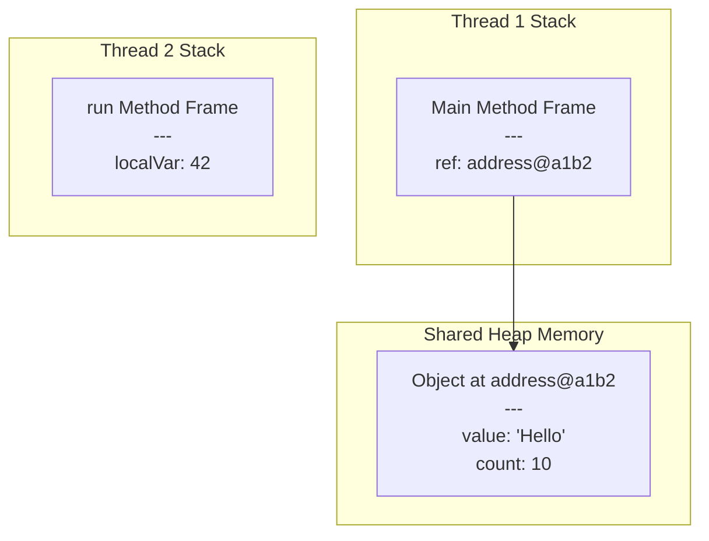

# Stack vs. Heap Memory in Java

| Feature           | Stack Memory                                      | Heap Memory                                                  |
| :---------------- | :------------------------------------------------ | :----------------------------------------------------------- |
| **Application**   | Used for thread execution; stores method calls and local references. | Used for dynamic allocation; stores all Java objects and their data. |
| **Lifespan**      | Exists only while the method is executing.        | Exists from object creation until it is garbage collected.   |
| **Order**         | LIFO (Last-In, First-Out).                        | Dynamic and unstructured.                                    |
| **Access**        | Very fast.                                        | Relatively slower.                                           |
| **Allocation**    | Automatic (by JVM compiler).                      | Dynamic (upon `new` keyword).                                |
| **Size**          | Fixed and typically small.                        | Large and flexible (configurable with `-Xmx`).               |
| **Thread Safety** | Yes (each thread has its own stack).              | No (shared among all threads, requires synchronization).     |
| **Memory Management** | Automatic (frame popped on method exit).       | Managed by Garbage Collector (GC).                           |
| **Errors**        | `StackOverflowError` when full.                   | `OutOfMemoryError` when full.                                |

- The stack holds method frames and local variables (primitives and object references).
- The heap holds the actual objects and their data.
- A reference variable on the stack acts as a pointer to the location of the object in the heap.

