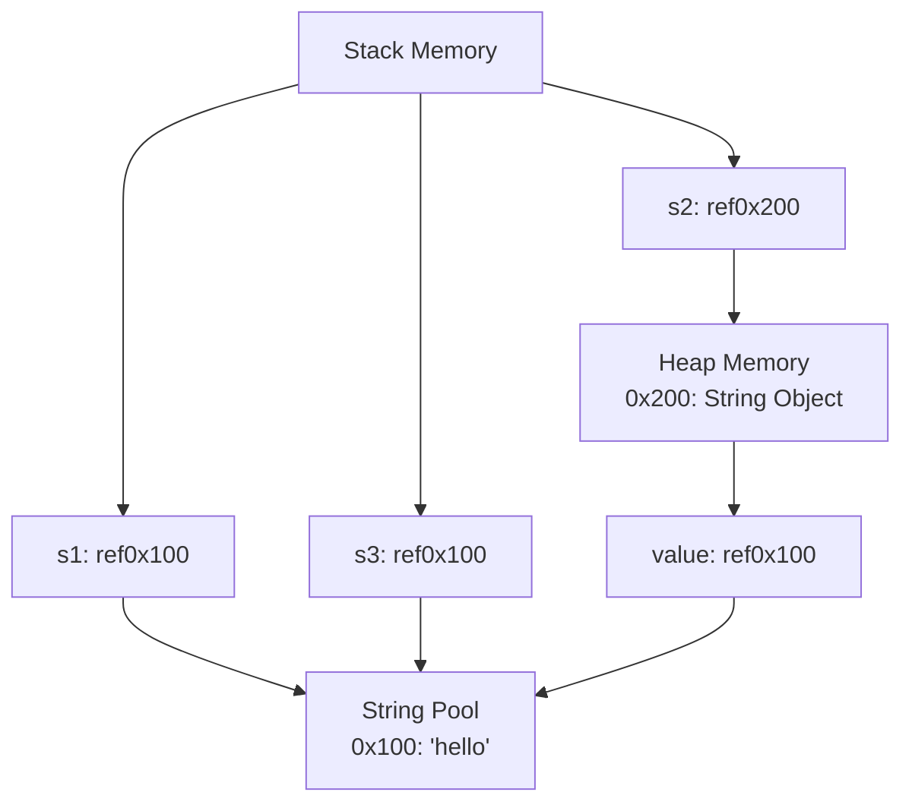

#### String Pool in Java
- The String Pool (also known as the String Intern Pool) is a special memory area in the Java heap where String literals are stored. It's a mechanism Java uses to optimize memory usage and improve performance for strings.
- 1. String Literals vs. String Objects
```java
// String literal - goes to String Pool
String s1 = "hello";

// String object - created in heap, outside pool
String s2 = new String("hello");

// Another literal - reuses from pool
String s3 = "hello";
```

# Key Characteristics of String Pool

| Aspect       | Description                                      |
| :----------- | :----------------------------------------------- |
| **Location** | Special area in the Java heap                    |
| **Purpose**  | Memory optimization and reuse                    |
| **Content**  | Stores unique string literals                    |
| **Mutability** | Strings are immutable, making pooling safe     |

#### The intern() Method
- The `intern()` method allows you to explicitly add strings to the pool or retrieve existing ones.

```java
public class StringPoolExample {
    public static void main(String[] args) {
        // These go to String Pool
        String s1 = "hello";
        String s2 = "hello";
        
        // This creates a new object in heap
        String s3 = new String("hello");
        
        // This explicitly interns the string
        String s4 = s3.intern();
        
        System.out.println(s1 == s2); // true - same reference
        System.out.println(s1 == s3); // false - different references
        System.out.println(s1 == s4); // true - s4 now points to pool
    }
}
```
#### Examples and Comparisons
- Example 1: Literal vs. Object Creation
```java
public class StringComparison {
    public static void main(String[] args) {
        String literal1 = "java";
        String literal2 = "java";
        String object1 = new String("java");
        String object2 = new String("java");
        
        System.out.println("literal1 == literal2: " + (literal1 == literal2)); // true
        System.out.println("object1 == object2: " + (object1 == object2));     // false
        System.out.println("literal1 == object1: " + (literal1 == object1));   // false
        
        System.out.println("literal1.equals(object1): " + literal1.equals(object1)); // true
    }
}
```
#### Example 2: String Concatenation
```java
public class StringConcatenation {
    public static void main(String[] args) {
        String s1 = "hello";
        String s2 = "world";
        
        // Compile-time concatenation - goes to pool
        String s3 = "helloworld";
        String s4 = "hello" + "world";
        
        // Runtime concatenation - creates new object
        String s5 = s1 + s2;
        String s6 = s1 + "world";
        
        System.out.println(s3 == s4); // true - both in pool
        System.out.println(s3 == s5); // false - s5 is new object
        System.out.println(s3 == s6); // false - s6 is new object
        
        // Force into pool
        String s7 = (s1 + s2).intern();
        System.out.println(s3 == s7); // true - now both in pool
    }
}
```
#### Benefits of String Pool
1. Memory Efficiency: Reduces duplicate strings in memory
2. Performance: Faster string comparison using == (when appropriate)
3. Reduced GC Overhead: Fewer string objects means less garbage collection
#### When to Use intern()
```java
public class InternUseCase {
    public static void main(String[] args) {
        // Useful when reading many duplicate strings from files/network
        List<String> words = readLargeFile(); // Returns many duplicate words
        
        // Without interning - creates many duplicate objects
        List<String> rawList = new ArrayList<>();
        for (String word : words) {
            rawList.add(word); // Each word is a separate object
        }
        
        // With interning - reduces memory usage
        List<String> internedList = new ArrayList<>();
        for (String word : words) {
            internedList.add(word.intern()); // Reuse existing strings
        }
    }
    
    private static List<String> readLargeFile() {
        // Simulate reading from file
        return Arrays.asList("hello", "world", "hello", "java", "world", "hello");
    }
}
```
#### Important Considerations
> Don't overuse intern(): The pool has limited size and lives for JVM lifetime
> Use equals() for comparison: Always use .equals() unless you specifically need reference equality
> Java 7+: String pool moved from PermGen to heap, making it garbage collectable
> Pool size: Can be configured with -XX:StringTableSize JVM option
#### Best Practices
```java
public class StringBestPractices {
    public static void main(String[] args) {
        // ✅ Good: Use literals for known strings
        String name = "John";
        
        // ✅ Good: Use equals() for content comparison
        if (name.equals("John")) {
            System.out.println("Hello John!");
        }
        
        // ❌ Avoid: Unnecessary new String()
        String bad = new String("literal"); // Creates extra object
        
        // ✅ Good: Use StringBuilder/Buffer for complex concatenation
        StringBuilder sb = new StringBuilder();
        sb.append("Hello").append(" ").append("World");
        String result = sb.toString();
        
        // ⚠️ Use intern() judiciously: Only when you have many duplicates
        String userInput = "some repeated pattern";
        String interned = userInput.intern(); // Only if you expect many duplicates
    }
}
```
> The String Pool is a powerful optimization feature in Java that helps manage memory efficiently for strings, but it should be understood and used appropriately to avoid potential pitfalls.
